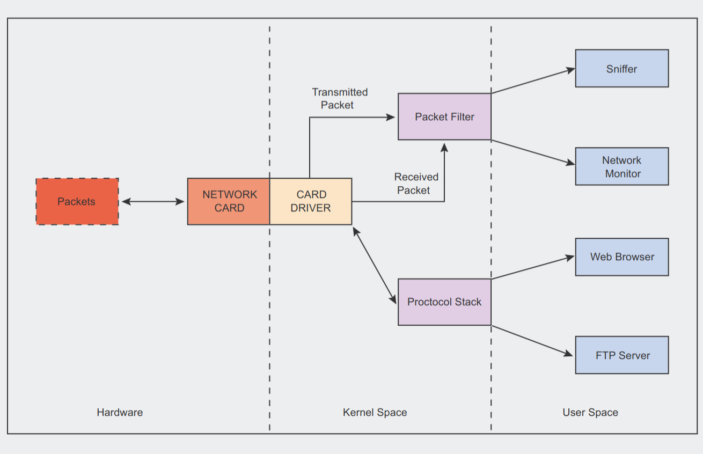
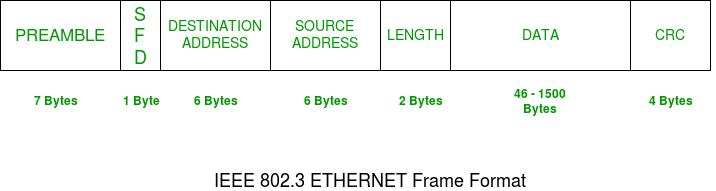
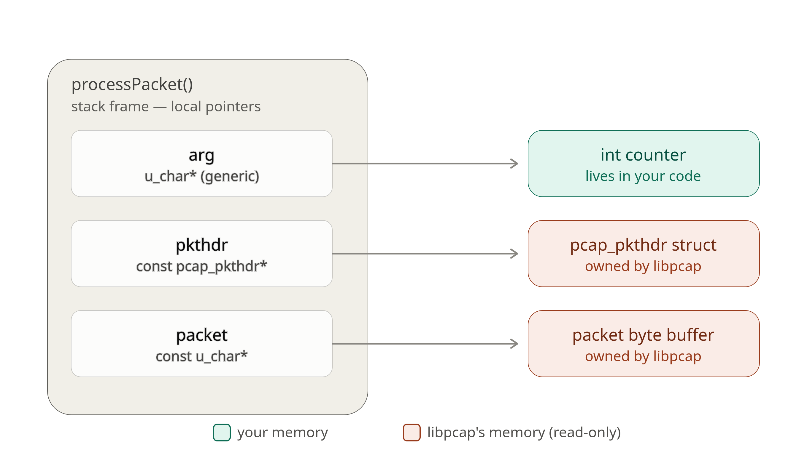

# NetSenital
 NetSentinel watches all packets in real time using a C++ program (low-level, fast — directly using your systems strength). It pulls out features like 'how many packets per second? which port? how large?', feeds them into a Python ML model, and the model instantly says: normal or attack.
=======
# NetSentinel

A C++ Network Intrusion Detection System (NIDS) that captures live network traffic using **libpcap**, parses packets, extracts flow features, and will later use a machine learning model to detect malicious traffic.

> **Status:** Work in Progress 🚧

---

## Features

- Live packet capture using libpcap
- Device enumeration
- Interactive network interface selection
- Raw packet inspection
- Packet parsing (coming soon)
- Flow tracking (planned)
- ML-based intrusion detection (planned)
- Prometheus metrics (planned)
- Grafana dashboard (planned)

---

## Project Structure

```text
NetSentinel/
├── images/
│   ├── network_capture_flow.png
│   ├── processpacket_pointer_memory_map.png
│   └── ...
├── include/
│   └── sniffer.hpp
├── src/
│   └── sniffer.cpp
└── README.md
```

---

# How Packet Capture Works

When a packet reaches your computer it first arrives at a **network interface card (NIC)**.

Examples of interfaces:

- `wlan0`
- `eth0`
- `lo`
- `docker0`

Libpcap attaches to one of these interfaces and copies packets before they are processed by higher layers.



---

# Packet Capture Pipeline

```
Internet
      │
      ▼
Network Interface
      │
      ▼
Linux Kernel
      │
      ▼
libpcap
      │
      ▼
NetSentinel
      │
      ▼
Packet Parser
      │
      ▼
Flow Tracker
      │
      ▼
ML Engine
```

---

# Device Enumeration

The project uses

```cpp
pcap_findalldevs()
```

to enumerate every network interface available on the operating system.

Internally, this function allocates a linked list.

```
alldevs
   │
   ▼
+---------+
| lo      |
| next ---+-------->
+---------+

          +---------+
          | wlan0   |
          | next ---+-------->
          +---------+

                    +---------+
                    | eth0    |
                    | next=NULL
                    +---------+
```

Each node is represented by `pcap_if_t`.

---

# Selecting an Interface

The linked list is traversed until the requested index is found.

```
head
 │
 ▼
lo → wlan0 → eth0 → nullptr
```

The selected node's `name` is passed to

```cpp
pcap_open_live()
```

---

# Understanding `pcap_t`

`pcap_t` is an **opaque structure** representing an active capture session.

It stores information required by libpcap such as:

- selected interface
- capture state
- filters
- buffer configuration

It **does not contain packet data**.

Each captured packet is delivered separately through the callback.

---

# Understanding the Packet Pointer

The callback receives

```cpp
const u_char* packet
```

This is **not an array**.

It is a pointer to the **first byte** of a contiguous block of memory.

```
packet
  │
  ▼
+------+------+------+------+------+
| 45 | 00 | 00 | 54 | 7A | ...
+------+------+------+------+------+
```

Accessing

```cpp
packet[5]
```

is equivalent to

```cpp
*(packet + 5)
```

---
# Understanding the Ethernet Headers



- First 7 bytes are reserved for preamble 
    A preamble is used for establishment of bit synchronization and was used in old systems. It was introduced to allow for the loss of few bits due to signal delay

- Next one byte is used for Start of frame delimiter
    This is a 1-Byte field that is always set to 10101011. SFD indicates that upcoming bits are starting the frame, which is the destination address.

- Next 6 bytes are designation address 
    This contain MAC address of machine for which the data is destined.

- Lenght is the next 2 byte field 
    It indicate the lenght of the whole frame.

- Data 
    Next the actual data is placed which is also known as  a payload.

- Cyclic Redundancy Check (CRC)
    CRC is 4 Byte field. This field contains a 32-bits hash code of data, which is generated over the Destination Address, Source Address, Length, and Data field. If the checksum computed by

---

# Packet Header

Every captured packet also has metadata.

```cpp
struct pcap_pkthdr
{
    timeval ts;
    bpf_u_int32 caplen;
    bpf_u_int32 len;
};
```

`caplen`

Number of bytes actually captured.

`len`

Actual size of the packet on the wire.

Always iterate over

```cpp
caplen
```

when reading `packet`.

---

# Callback Flow

```
pcap_loop()

        │

        ▼

processPackets()

        │

        ├── Increment packet counter

        ├── Read packet header

        ├── Access packet bytes

        └── Parse protocols
```
---
# Flow Tracking

Modern Intrusion Detection Systems do not analyze packets independently.
Instead, packets are grouped into **flows**, where a flow represents a
single network conversation.

A flow is uniquely identified by five fields:

- Source IP
- Destination IP
- Source Port
- Destination Port
- Protocol

These fields are stored inside a `FlowKey`.

```cpp
struct FlowKey
{
    std::string srcIp;
    std::string dstIp;
    uint16_t srcPort;
    uint16_t dstPort;
    uint8_t protocol;
};
```

Each captured packet is first parsed into a `PacketInfo` structure.
From this information a temporary `FlowKey` is generated.

The flow tracker searches the current flow table:

- If the key already exists, the packet counter for that flow is incremented.
- Otherwise, a new flow is created and inserted into the table.

```
Packet

   │

   ▼

PacketInfo

   │

   ▼

FlowKey

   │

   ▼

Flow Tracker

   │

 ┌─ Match ───────────────┐
 │                       │
 ▼                       ▼

Update Statistics     Create New Flow
```

Currently every flow stores:

- Flow identity (`FlowKey`)
- Packet count

Future versions will also maintain:

- Byte count
- Flow duration
- TCP flags
- Average packet size
- Packet rate
- Machine learning features

Flow tracking is the first step toward stateful intrusion detection and
forms the basis for future anomaly detection and machine learning modules.
---

# Memory Layout



---

# Current Progress

- [x] Enumerate interfaces
- [x] Select capture device
- [x] Open capture session
- [x] Capture live packets
- [x] Hex dump
- [x] Ethernet parsing
- [x] IPv4 parsing
- [x] TCP parsing
- [x] UDP parsing
- [x] ICMP parsing
- [x] Unified `PacketInfo` representation
- [x] FlowKey generation
- [x] Flow tracking
- [x] Packet counting per flow
- [ ] Flow statistics (bytes, duration)
- [ ] Feature extraction
- [ ] Detection engine
- [ ] Machine learning integration
- [ ] Prometheus metrics
- [ ] Grafana dashboard


---
#Build

-clone the repo and 
```
g++ -g -Wall -Wextra -Wshadow src/sniffer.cpp src/parser.cpp src/flow.cpp -o simplesniffer -lpcap
```
---

# References

- libpcap Documentation
- Geeksforgeeks
- TCP/IP Illustrated — W. Richard Stevens
- Beej's Guide to Network Programming
